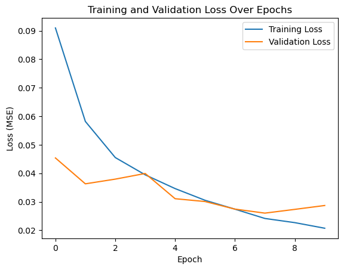
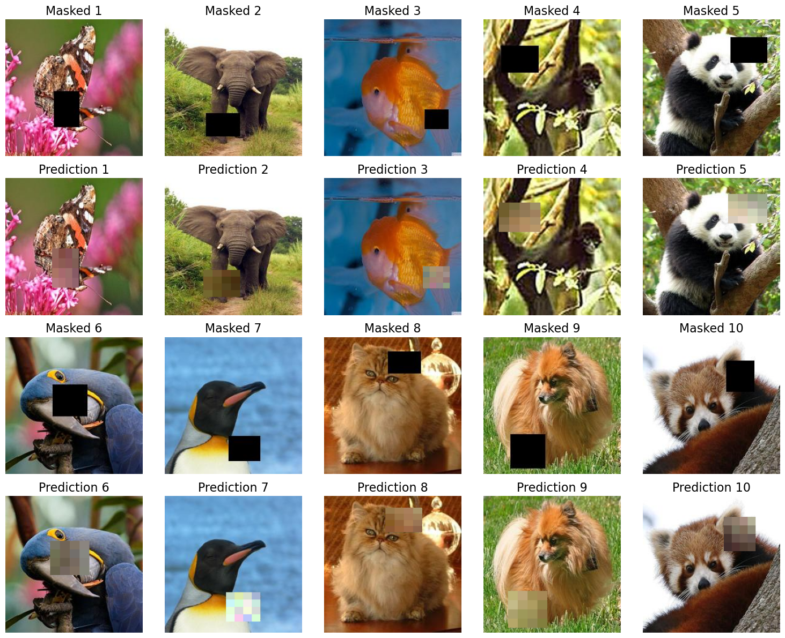
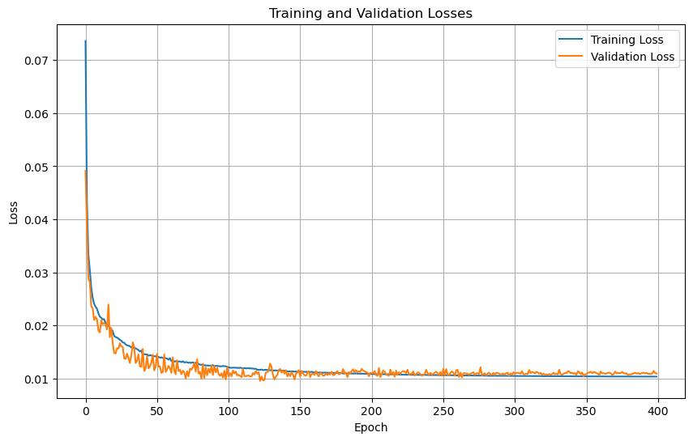

# Photo Reconstruction Project

## Table of Contents
1. [Introduction](#introduction)
    - [Background and Motivation](#background-and-motivation)
    - [Dataset and Data Preparation](#dataset-and-data-preparation)
    - [Models and Objectives](#models-and-objectives)
2. [Models](#models)
    - [Baseline Model](#baseline-model)
    - [Linear Regression Model](#linear-regression-model)
    - [Basic Neural Network](#basic-neural-network)
    - [Attention Model](#attention-model)
3. [Results Summary](#results-summary)
4. [Dataset Preparation](#dataset-preparation)
5. [Saved Models](#saved-models)

---

## Introduction

### Background and Motivation
The goal of this project is to reconstruct missing regions in images using machine learning techniques. The reconstructed images are compared with the original ground-truth images using quantitative metrics such as Mean Squared Error (MSE) and Mean Absolute Error (MAE), as well as visual examples.

### Dataset and Data Preparation
- **Dataset**: Curated using 10 selected classes from ImageNet: butterfly, panda, parrot, pomeranian, goldfish, elephant, monkey, Persian cat, penguin, and red panda.
- **Image Dimensions**: Each image is resized to \(224 	imes 224\) pixels.
- **Masked Regions**: Blacked-out regions of random sizes ranging from \(30 	imes 30\) to \(60 	imes 60\) pixels simulate missing data. The positions of the masks are randomized.
- **Dataset Splits**:
    - Training: 70%
    - Validation: 10%
    - Testing: 20%

---

## Models

### Baseline Model
- **Description**: Assigns random RGB values to the masked regions.
- **Results**:
  | **Metric**               | **Value**     |
  |--------------------------|---------------|
  | Mean Squared Error (MSE) | 1139.2030     |
  | Mean Absolute Error (MAE)| 7.0292        |
- **Visualization**:
  

---

### Linear Regression Model
- **Description**: Splits the masked region into 4 subregions and predicts pixel values using linear regression for each subregion.
- **Training**:
    - Weights are initialized using [Kaiming Initialization](https://www.geeksforgeeks.org/kaiming-initialization-in-deep-learning/).
    - Gradient descent is used to train the weights.
- **Results**:
  | **Metric**               | **Value**     |
  |--------------------------|---------------|
  | Mean Squared Error (MSE) | 446.1911      |
  | Mean Absolute Error (MAE)| 4.4127        |
- **Visualization**:
  

---

### Basic Neural Network
- **Description**: A CNN that predicts the mean RGB value of subregions in the masked areas.
- **Training**:
    - Detects masked regions and splits them into \(4 	imes 4\) subregions.
    - Uses Mean Squared Error (MSE) loss for training.
- **Results**:
  | **Metric**               | **Value**     |
  |--------------------------|---------------|
  | Mean Squared Error (MSE) | 336.2765      |
  | Mean Absolute Error (MAE)| 3.4692        |
- **Visualization**:
  - **Loss Curve**:
  - 
    
  - 
  - **Reconstruction Quality**:
  - 
    

---

### Attention Model
- **Description**: A CNN with spatial and channel attention mechanisms for enhanced reconstruction.
- **Components**:
    - **Spatial Attention**: Highlights important spatial regions.
    - **Channel Attention**: Adjusts the importance of individual feature channels.
    - **Residual and Skip Connections**: Aid in gradient flow and reuse features.
- **Results**:
  | **Metric**               | **Value**     |
  |--------------------------|---------------|
  | Mean Squared Error (MSE) | 57.1340       |
  | Mean Absolute Error (MAE)| 1.3617        |
- **Visualization**:
  - **Architecture**:
    
  - **Loss Curve**:
    
  - **Reconstruction Quality**:
    

---

## Results Summary
The following table summarizes the performance of all models:

| **Metric**               | **Model**            | **Value**         |
|--------------------------|----------------------|-------------------|
| Mean Squared Error (MSE) | Baseline             | 1139.2030         |
|                          | Linear Regression    | 446.1911          |
|                          | Neural Network       | 336.2765          |
|                          | **Attention (Best)** | **57.1340**       |
| Mean Absolute Error (MAE)| Baseline             | 7.0292            |
|                          | Linear Regression    | 4.4127            |
|                          | Neural Network       | 3.4692            |
|                          | **Attention (Best)** | **1.3617**        |

---

## Dataset Preparation
- **Downloading**: Retrieve the dataset from the [Hugging Face repository](https://huggingface.co/).
- **Dataset Structure**:
  ```
  dataset/
    train/
      image1.jpg
      image1_masked.jpg
      ...
    validation/
      ...
    test/
      ...
  ```
- **Example Dataset**: Preprocessed datasets are available [here](https://drive.google.com/drive/folders/16jMNDl2-trXoFd3qisRZFyc2A2pp858E?usp=sharing).

---

## Saved Models
- **Format**: Trained models are saved as `.pth` files.
- **Example Models**: Available for download [here](https://drive.google.com/drive/folders/16jMNDl2-trXoFd3qisRZFyc2A2pp858E?usp=sharing).

---
